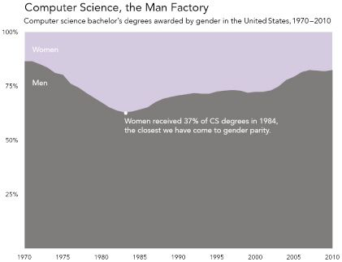

# Gender Discrimination and Sexism in Computer Science
## By Dhruv Jagannath ##
*July 12, 2023*
## Data Viz Summary ##

The graphic chronologically illustrates the percentages of CS bachelor's degrees awarded to men and women to highlight the disturbing increase in female underrepresentation in the field over time. 

As the graph progresses, the location of the line shows the percentage of male recipients and the percentage of female recipients is shown by the remaining space. 

The caption in the center accentuates the situational direness the graph shows because "37%" is positively equated with progress towards gender equality in CS (D'Ignazio and Klein, "The Power Chapter"). 

That means out of 54 CS bachelor's recipients, only 20 would be women, and that's severe underrepresentation during what's presented as the height of progress in this field.

*Data Feminism* argues (Block Quote):
> As “data analysts” (low-status number crunchers) have 
> become rebranded as “data scientists” (high status researchers), women are being pushed out in order to make 
> room for more highly valued and more highly compensated men (D'Ignazio and Klein, "The Power Chapter").
## Data Viz Biography ##

Hyperlink: [*Data Feminism* Chapter 1](https://data-feminism.mitpress.mit.edu/pub/vi8obxh7/release/4)

Emoji: :grimacing:

